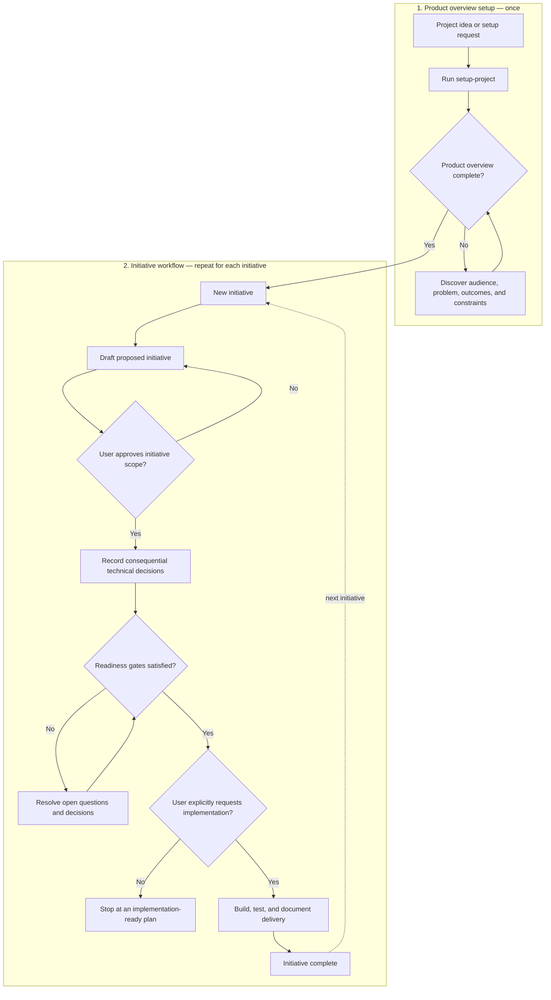

# Project Agent Instructions

Shared conventions for any AI coding agent working in this repo (Codex, Claude Code, or others). Keep this under ~200 lines — push detail into skills or docs/ rather than growing this file.

## Build & test

`npm install`, `npm run dev`, `npm run check` (typecheck), `npm run format:check` (Prettier), `npm run build`, `npm run preview`. See [README.md](README.md#development).

## Conventions

Astro (`.astro` components/pages) with TypeScript — see [ADR-0001](docs/adr/0001-astro-build-tooling.md). Repeated content (project cards, contact links) is plain typed TS data under `src/data/`, not Zod-validated — see [ADR-0002](docs/adr/0002-typed-data-content-representation.md). Prefer `type` over `interface`. Formatting is enforced by Prettier (`npm run format`); don't hand-format.

Use the host's native interactive questioning tool when it is available and appropriate.

## Documentation-first product lifecycle

For requests to initialise, set up, start, bootstrap, or kick off a project, use the [`setup-project`](.claude/skills/setup-project/SKILL.md) skill. These requests authorise discovery and documentation only; they do not by themselves authorise application scaffolding, dependency installation, service selection, or deployment configuration.

The lifecycle has two stages: establish the product overview once, then run the initiative workflow for each body of work. The product overview remains a living document, but completing an initiative does not restart product setup.

Implementation is ready only when the product overview is complete, the relevant initiative is `Approved`, blocking questions are resolved, required ADRs are accepted, and the user explicitly requests implementation. Missing decisions are blockers to resolve, not permission for the agent to choose silently.

## Before proposing architecture, dependency, or scope changes

Check for existing decisions before proposing something new:

- [Architecture Decision Records](docs/adr/README.md) — architecture and technical decisions
- [Product decision log](docs/product/decisions.md) — features cut, scope changes, and positioning

If a past decision conflicts with the current request, surface it — don't silently override it.

## Where things live

See the [documentation map](docs/README.md) for the full structure.
